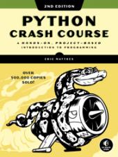

# Python Crash Course, Second Edition
{: .fs-9 }

This is a collection of resources for [Python Crash Course (2nd Ed.)](https://www.nostarch.com/pythoncrashcourse2e/), an introductory programming book from [No Starch Press](https://www.nostarch.com) by Eric Matthes.
{: .fs-6 .fw-300 }

The simplest way to download the source code files for the book is to click on the Download .zip button below. This will download the source code files for all chapters, as well as a number of data files and images you'll need for the projects.
{: .fs-6 .fw-300 }

[Download .zip](https://github.com/ehmatthes/pcc_2e/zipball/master/){: .btn .btn-primary .fs-5 .mb-4 .mb-md-0 .mr-2 } [View on GitHub](https://github.com/ehmatthes/pcc_2e/){: .btn .fs-5 .mb-4 .mb-md-0 }

---

If you have any questions about Python Crash Course, feel free to get in touch:
{: .fs-6 .fw-300 }

Email: [ehmatthes@gmail.com](mailto:ehmatthes@gmail.com)

Twitter: [@ehmatthes](https://twitter.com/ehmatthes)

The full set of resources will be posted as soon as the book is available.

---

Available from <a href="https://nostarch.com/pythoncrashcourse2e">No Starch Press</a>, <a href="https://www.amazon.com/Python-Crash-Course-2nd-Edition/dp/1593279280">Amazon</a>, and [Barnes & Noble](https://www.barnesandnoble.com/w/python-crash-course-2nd-edition-eric-matthes/1129705311/). You can also find *Python Crash Course* in person at Barnes & Noble bookstores, and other fine booksellers worldwide.
